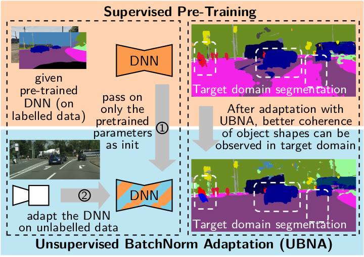

# Unsupervised BatchNorm Adaptation (UBNA): A Domain Adaptation Method for Semantic Segmentation Without Using Source Domain Representations

[Marvin Klingner](https://www.tu-braunschweig.de/en/ifn/institute/team/sv/klingner), [Jan-Aike Termöhlen](https://www.tu-braunschweig.de/en/ifn/institute/team/sv/termoehlen), Jacob Ritterbach, and [Tim Fingscheidt](https://www.tu-braunschweig.de/en/ifn/institute/team/sv/fingscheidt)


[Link to paper](https://arxiv.org/abs/2011.08502) 

<p align="center">
  
</p>

## Citation

If you find our work useful or interesting, please consider citing [our paper](https://arxiv.org/abs/2011.08502):

```
@article{klingner2020unsupervised,
 title   = {{Unsupervised BatchNorm Adaptation (UBNA): A Domain Adaptation Method for Semantic Segmentation Without Using Source Domain Representations}},
 author  = {Marvin Klingner and
            Jan-Aike Term\"{o}hlen and
            Jacob Ritterbach and
            Tim Fingscheidt
           },
 year = {2020}
 archivePrefix = {arXiv},
 eprint = {2011.08502},
}
```

## Getting Started

To run our code you need to go through the following steps: 
1. Start a fresh conda environment and install the necessary packages as follows:
    * ``conda install pytorch=1.6 torchvision cudatoolkit=10.2 -c pytorch``
    * ``pip install tensorboardX``
    * ``pip install opencv-contrib-python``
    * ``conda install -c conda-forge python-wget`` <i>(just necessary for kitti download script)</i>

2. Create a dataset folder where all the used datasets will be stored. Specify the environment variables `UBNA_DIR_DATASET` and `UBNA_DIR_CHECKPOINT`, leading to the paths of this dataset folder and the folder where the checkpoints are to be saved. Depending on your operating system, this can be done as follows:
    * Windows: 
        ```bash 
        setx UBNA_DIR_DATASET <PATH_TO_DATASET>
        setx UBNA_DIR_CHECKPOINT <PATH_TO_CHECKPOINTS>
        ```
    * Linux:
        ```bash
        export UBNA_DIR_DATASET=<PATH_TO_DATASET>
        export UBNA_DIR_CHECKPOINT=<PATH_TO_CHECKPOINTS>
        ```
        
3. To download the datasets, you can use the following steps. Note that you do not necessarily need all datasets for all experiments (e.g. for GTA to Cityscapes you only need gta-5 and Cityscapes and Cityscapes sequence datasets), but if you download all datasets mentioned here, you should be able to run all experiments described in the paper:
   * Cityscapes: Create a folder called `cityscapes` in your dataset folder. Go to https://www.cityscapes-dataset.com/downloads/, log in, download and unpack the following dataset parts into that folder:
        * leftImg8bit_trainvaltest.zip
        * gtFine_trainvaltest.zip
   * Cityscapes (sequences): Create a folder called `cityscapes_sequence` in your dataset folder. Go to https://www.cityscapes-dataset.com/downloads/, log in, download and unpack the following dataset parts into that folder:
        * leftImg8bit_sequence_trainvaltest.zip
   * SYNTHIA: Download the SYNTHIA dataset (SYNTHIA-RAND-CITYSCAPES) from https://synthia-dataset.net/downloads/ and rename the folder to `synthia` afterwards. Run the script in `data_download/convert_segmentation_synthia.py` to convert the labels to a nicer format.
   * GTA-5: Download all parts of the GTA-5 dataset from https://download.visinf.tu-darmstadt.de/data/from_games/. Put all color images in a subfolder `images` and all labels in a subfolder `labels`. Rename the main folder to `gta5` afterwards.
   * GTA-5 (full split): Create an empty folder called `gta5_full_split`. It will be used later to store the split information for the GTA-5 dataset.
   * KITTI: You can use the script `download_kitti.py` in the `data_download` folder. It will automatically create a folder called `kitti_download` and download all necessary parts of the KITTI dataset. Please rename the folder to `kitti` afterwards.
   * KITTI (kitti split): Create an empty folder called `kitti_kitti_split`. It will be used later to store the split information for the KITTI dataset.
   * KITTI 2015: 
        * Create a folder called `kitti_2015`. Download the `stereo_2015/flow_2015/scene_flow_2015` dataset from http://www.cvlibs.net/datasets/kitti/eval_scene_flow.php into that folder.
        * Download the labels from http://www.cvlibs.net/datasets/kitti/eval_semseg.php?benchmark=semantics2015 and place them in the respective folders in the `kitti_2015` directory.

4. Download the .json files from the following download links and place them in the dataset folders. 
    * Cityscapes: https://drive.google.com/drive/folders/1E9RdGX-uAtrU1p_OLjOrVI4tKBdZwg6W?usp=sharing
    * Cityscapes (sequences): https://drive.google.com/drive/folders/1EKGfzjotMc8_R42nHaMmwIfyyv0W4Q42?usp=sharing
    * SYNTHIA: https://drive.google.com/drive/folders/11tzLxx7DvD0xrAyDpHpXIUGC62Xs14jI?usp=sharing
    * GTA-5: https://drive.google.com/drive/folders/1uv4iaOiJ0fbZOHcrTcmFLqje5WdXazPR?usp=sharing
    * GTA-5 (full split): https://drive.google.com/drive/folders/18t4Alb8jhk8Y7BqbxAAK9k8-Yqx1wxBE?usp=sharing
    * KITTI : https://drive.google.com/drive/folders/1i2n5SmKWmst0CenxUznUHZ0oxJzlBfS9?usp=sharing
    * KITTI (kitti split): https://drive.google.com/drive/folders/14ymxqZD1VeH1lBUbX6YwfivBI_mo2a0h?usp=sharing
    * KITTI 2015: https://drive.google.com/drive/folders/1ru77CfONBDwGmU0jwZnFUgrG8e9j6hEp?usp=sharing
    
    The resulting folder structure should look as follows. 

    ```bash
    .
    ├── cityscapes
    │   ├── gtFine
    │   ├── leftImg8bit
    │   ├── basic_files.json
    │   ├── parameters.json
    │   ├── train.json
    │   ├── validation.json
    │   └── test.json
    │ 
    ├── cityscapes_sequence
    │   ├── leftImg8bit_sequence
    │   ├── basic_files.json
    │   ├── parameters.json
    │   ├── train.json
    │   ├── validation.json
    │   └── test.json
    │ 
    ├── synthia
    │   ├── RAND_CITYSCAPES
    │   ├── basic_files.json
    │   ├── parameters.json
    │   └── train.json
    │ 
    ├── gta5
    │   ├── images
    │   ├── labels
    │   ├── basic_files.json
    │   └── parameters.json
    │
    |── gta5_full_split
    |   └── train.json
    |
    ├── kitti
    │   ├── Raw_data
    │   ├── basic_files.json
    │   └── parameters.json
    │
    │── kitti_kitti_split
    │   ├── test.json
    │   ├── train.json
    │   └── validation.json
    │
    └── kitti_2015
        ├── training
        ├── testing
        ├── basic_files.json
        ├── parameters.json
        ├── test.json
        ├── train.json
        └── validation.json
    

    ```

# Pretraining of the Semantic Segmentation Network

With this code example we demonstrate the adaptation from GTA-5 to Cityscapes as described in our paper. The commands for the other settings can be found in the `experiments` folder. The precedure, however, remains the same for all settings.
For pretraining the semantic segmentation network, there is a `train.py` provided. There are different options available. For a full list see `arguments.py`. Our pretraining procedure is given by the following command and involves using only the weighted cross-entropy loss as described in the paper.

```
python3 train.py \
        --model-name ubna_pretrained_seg_gta_vgg16 \
        --model-type "vgg" \
        --model-num-layers-vgg 16 \
        --segmentation-training-loaders "gta5_train" \
        --segmentation-training-batch-size 12 \
        --experiment-class "ubna_pretrained_models"
```

You can of course also simply run the `pretrain.sh` shell script located in the `experiments/gta_to_cs/` directory.
The pretrained model will be saved in the folder `ubna_pretrained_models` within the directory you specified before with the environment variable `UBNA_DIR_CHECKPOINT`.

<a href="https://drive.google.com/drive/folders/1D9s36N5gqVa9LLGRequkzswli1T0xrd9?usp=sharing">Download the pretrained baseline</a>

# Adaptation of the Network to the New Domain

For adaption of the network to the new domain using our *UBNA*-method, you can choose between the two approaches we introduced in our paper:

#### 1) Batch-wise decaying BN-momentum (UBNA)
To adapt the network with batch-wise decaying BN-momentum (i.e., BN momentum is shrinking in dependency on the number of batches alreday used for adaptation), you may run the `adapt_ubna.sh` shell script in `experiments/gta_to_cs`, which you can find within the experiments directory. Our used setup is given by the command:
      
```  
python3 adapt.py \
        --model-name ubna_adaption_gta_to_cs_vgg16_BS6_alpha_batch=0.08_alpha_layer=0 \
        --adaptation-training-loaders "cityscapes_sequence_train" \
        --adaptation-resize-width 1024 \
        --adaptation-resize-height 512 \
        --adaptation-training-batch-size 6 \
        --model-type "vgg" \
        --model-num-layers-vgg 16 \
        --model-load ubna_pretrained_models/ubna_pretrained_seg_gta_vgg16/checkpoints/epoch_20 \
        --model-disable-lr-loading \
        --experiment-class "ubna_adapted_models" \
        --adaptation-alpha-batch 0.08 \
        --adaptation-mode-sequential "batch_shrinking" \
        --adaptation-num-batches 50
```        

Make sure that the `model.pth` file of the pretrained model is located in the folder `ubna_pretrained_models/ubna_pretrained_seg_gta_vgg16/checkpoints/epoch_20` specified in the `model-load` argument. 

<a href="https://drive.google.com/drive/folders/1kfSMGdY8r4OULULVpGyRhXlHmlP6ldpX?usp=sharing">Download the <b>UBNA</b> model</a>

#### 2) Additional layer-wise decaying BN-momentum (UBNA+)
For adapting the Network with an additional layer-wise decaying weighting factor, that is shrinking in dependency on the number of trained batches **and** additionally is set individually for each BN layer, run the shell script `adapt_ubna_plus.sh`, which you can find within the `experiments/gta_to_cs` directory. Our used setup is given by the command:

```
python3 adapt.py \
        --model-name ubna_adaption_gta_to_cs_vgg16_BS6_alpha_batch=0.08_alpha_layer=0.03 \
        --adaptation-training-loaders "cityscapes_sequence_train" \
        --adaptation-resize-width 1024 \
        --adaptation-resize-height 512 \
        --adaptation-training-batch-size 6 \
        --model-type "vgg" \
        --model-num-layers-vgg 16 \
        --model-load ubna_pretrained_models/ubna_pretrained_seg_gta_vgg16/checkpoints/epoch_20 \
        --model-disable-lr-loading \
        --experiment-class "ubna_adapted_models" \
        --adaptation-alpha-batch 0.08 \
        --adaptation-alpha-layer 0.03 \
        --adaptation-mode-sequential "layer_shrinking" \
        --adaptation-num-batches 50
```

In both cases, you can choose the number of adaptation steps using the argument `adaptation-num-batches`.
After adaption, the model will be saved in the directory `ubna_adapted_models` within the directory you specified before with the environment variable `UBNA_DIR_CHECKPOINT`.

<a href="https://drive.google.com/drive/folders/10KFzIFzcZqvsGcV7uVTmCh0G5MfsGAbq?usp=sharing">Download the <b>UBNA+</b> model</a>


# Evaluation of the Network

For evaluation of the network, run the `evaluate.sh` shell script, which you can find within the experiments directory.
Make sure that the correct path to the model files is specified in the parameter `model_load` as given in the below examples. 
Also note that the paths are defined relative to the ``UBNA_DIR_DATASET`` directory.

```
python3 eval_segmentation.py \
        --sys-best-effort-determinism \
        --model-type "vgg" \
        --model-name "eval_cs" \
        --model-load ubna_adapted_models/ubna_adaption_cs_to_kitti_vgg16_BS6_alpha_batch=0.08_alpha_layer=0.3/checkpoints/batch_50 \
        --segmentation-validation-loaders "cityscapes_validation"
```

# Pre-Trained Models

Our provided models should meet the marks provided in the paper which you should be able to reproduce (up to a small margin, as the PyTorch framework is not deterministic during training): 

| Model      | Cityscapes to KITTI| SYNTHIA to Cityscapes | GTA-5 to Cityscapes |
|------------|--------------------|-----------------------|---------------------|
| Baseline   | <a href="https://drive.google.com/drive/folders/1ARK41sQU4wHGTrkj-scMzUCLXJaHNAHn?usp=sharing">Download </a> | <a href="https://drive.google.com/drive/folders/1R7dxxMEp7tqMO6hIaonegTyJHTpNK3ks?usp=sharing">Download </a> | <a href="https://drive.google.com/drive/folders/1D9s36N5gqVa9LLGRequkzswli1T0xrd9?usp=sharing">Download </a> |
|            |                    |                       |                     |
| UBNA       | <a href="https://drive.google.com/drive/folders/1GI1hJn_VUvpaNuFTrqGjliNdIeI2v2sR?usp=sharing">Download </a> | <a href="https://drive.google.com/drive/folders/1j3Hss7IWChOxyDI00yThww4-dKbfP4NY?usp=sharing">Download </a> | <a href="https://drive.google.com/drive/folders/1kfSMGdY8r4OULULVpGyRhXlHmlP6ldpX?usp=sharing">Download </a> |
|            |                    |                       |                     |
| UBNA+      | <a href="https://drive.google.com/drive/folders/1noqjrAaGWEOHz2MSvutWcCdZs-Gqs_eN?usp=sharing">Download </a> | <a href="https://drive.google.com/drive/folders/1E8mlJcAeZ6wcXNagp0AHkbZ-yYN_a5QN?usp=sharing">Download </a> | <a href="https://drive.google.com/drive/folders/10KFzIFzcZqvsGcV7uVTmCh0G5MfsGAbq?usp=sharing">Download </a> |

<i>There is a small "Download" button at the top right</i>

## License
This code is licensed under the <b>MIT-License</b> feel free to use it within the boundaries of this license.
